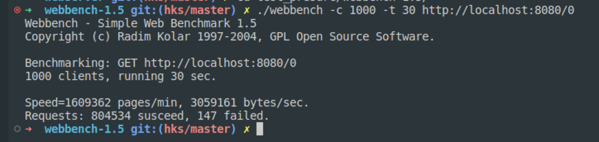
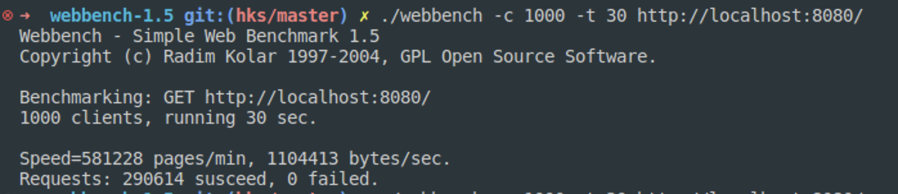

# 原版本
主线程分发与网络io(非阻塞io)
其它线程池线程负责报文处理
使用epoll进行协作
首先创建epoll，监听listenfd事件。
当listenfd触发epoll_in事件后初始化连接对象信息

当收到epoll_in事件，使用recv读取对应连接fd的报文信息
把对象作为任务加入线程池中
同时通过条件变量唤醒一个等待线程（可能的惊群问题）
线程开始处理，此时分别执行读取与报文解析，response缓冲构建
最后结束后向epollfd发送写时间，epoll_fd收到写事件后send报文

# Eventloop and reactor版本
使用EventLoop于主线程管理事件
使用线程池处理请求、业务解析与IO

# 测试结果
+ 调整日志输出级别，调整task上限10000，不使用TCP_NODELAY，正常组包下linux虚拟机本地测试

+ 正常输出日志，调整线程池task上限65535，不使用TCP_NODELAY，正常组包下linux虚拟机本地测试

